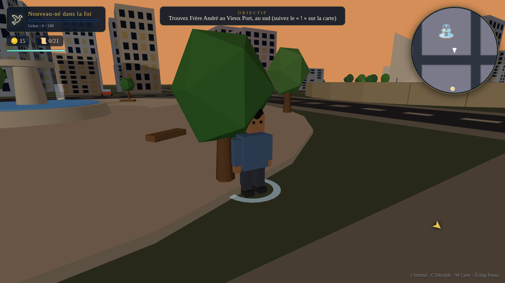

# ✝ KAIROS — Le Chemin du Disciple

**Un jeu 3D en monde ouvert, jouable dans le navigateur, où l'on grandit du « nouveau-né dans la foi » jusqu'au disciple qui forme d'autres disciples.**

> « Le temps (*kairos*) est accompli, et le royaume de Dieu est proche. » — Marc 1:15

Explorez librement **Théopolis**, une ville ouverte avec son port, ses jardins, son grand marché, son arène et sa colline du Temple. Suivez 5 mentors à travers **15 quêtes inspirées des paraboles bibliques**, faites grandir les **9 fruits de l'Esprit**, revêtez pièce par pièce **l'armure de Dieu** (visible sur votre personnage !), conduisez des voitures, trouvez les 21 versets cachés — jusqu'à la maturité chrétienne.



## ▶ Jouer

**Option 1 — double-clic (le plus simple) :**
ouvrez le fichier **`KAIROS-standalone.html`** dans Chrome, Edge ou Firefox. C'est tout — le jeu entier tient dans ce fichier.

**Option 2 — version développement (fichiers séparés) :**
```bash
python3 -m http.server 8000
# puis ouvrez http://localhost:8000
```
(Les modules ES exigent un serveur ; n'importe quel hébergement statique fonctionne : GitHub Pages, Netlify…)

Aucun backend, aucune base de données : la sauvegarde est automatique dans le navigateur (localStorage).

## 🎮 Commandes

| Touche | Action |
|---|---|
| **Z Q S D** / W A S D / flèches | Se déplacer (AZERTY et QWERTY détectés automatiquement) |
| **Souris** (cliquer pour capturer) | Caméra orbitale |
| **Maj** | Courir (jauge d'Esprit) |
| **Espace** | Sauter |
| **E** | Interagir / conduire |
| **J** | Journal des quêtes |
| **C** | Fiche du disciple (fruits & armure) |
| **M** | Grande carte |
| **K** | Musique on/off |
| **Échap** | Pause |

## 🌱 La progression spirituelle

| Étape | Référence |
|---|---|
| 🕊 Nouveau-né dans la foi | 1 Pierre 2:2 |
| 🌱 Enfant de la foi | 1 Jean 2:13 |
| 🤝 Serviteur fidèle | Matthieu 25:21 |
| 🗻 Adulte dans la foi | Hébreux 5:14 |
| ✝ Père spirituel | Matthieu 28:19 |
| 👑 Disciple accompli | 2 Timothée 4:7 |

Chaque étape débloque des pièces de **l'armure de Dieu** (Éphésiens 6) qui apparaissent physiquement sur le personnage : ceinture de la vérité, chaussures de l'Évangile, cuirasse de la justice, bouclier de la foi, casque du salut, épée de l'Esprit.

## 📖 Les 15 quêtes (paraboles)

L'Appel · La Brebis Perdue · Le Lait de la Parole · Le Semeur · Le Bon Samaritain · Soixante-dix fois sept · Les Talents · Le Pain Partagé · La Perle de Grand Prix · Le Combat Spirituel · La Maison sur le Roc · Veillez et Priez · Le Fils Prodigue · Va, fais des disciples · La Course Achevée

Avec 4 mini-jeux : quiz de la Parole, gestion des talents, livraison chronométrée des pains, et l'arène du combat spirituel (esquive/collecte en 3D).

## 🛠 Technique

- **Three.js r160** (vendorisé en local — aucun CDN), WebGL, 100 % côté client
- Ville générée **procéduralement** (bâtiments instanciés, ~105 draw calls)
- Cycle jour/nuit complet, lampadaires, étoiles, trafic routier autonome
- Musique **générative** (WebAudio, aucun fichier audio)
- Aucune dépendance d'exécution, aucun build requis pour la version modules

Pour régénérer le fichier autonome : `npm i esbuild && node build-standalone.js`

## 📄 Rapport de développement

Voir **[RAPPORT.md](RAPPORT.md)** pour un état honnête et détaillé : ce qui fonctionne, ce qui est simplifié, et les pistes pour aller plus loin.

---

*Assets 3D : géométrie procédurale low-poly générée par code (aucun asset externe). Textes bibliques : traduction Louis Segond (domaine public).*
